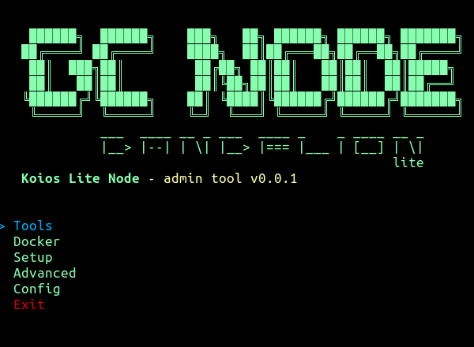

# Koios Administration Tool

## Introduction
The Koios Administration Tool is a comprehensive script designed to manage and monitor various aspects of a Koios Lite Node environment. This tool offers functionalities ranging from installing dependencies to handling Docker containers, managing environment files, and providing a user-friendly interactive menu for various administrative tasks. It streamlines administration of Koios Lite Node and related components, making it accessible and efficient for users.

## Features and Commands
### --install-dependencies
```bash
install_dependencies() {
    # Code to install necessary dependencies
}
```
Installs the necessary dependencies based on the operating system, supporting various Linux distributions, macOS, and providing guidance for manual installation on Windows.

### --check-docker
```bash
check_docker() {
    # Code to check Docker status and handle its installation/startup
}
```
Checks if Docker and Docker Compose are installed and running, and prompts the user to install or start Docker if necessary.

### --handle-env-file
```bash
handle_env_file() {
    # Code for managing .env file (add, edit, remove, view, reset)
}
```
Manages the `.env` file, allowing users to add, edit, remove, view, and reset entries in an interactive manner.

### --reset-env
```bash
reset_env_file() {
    # Code to reset .env file
}
```
Resets the `.env` file to its default state, creating backups of the existing file.

### --docker-status
```bash
docker-compose ps
```
Shows the current status of Docker containers, helping users to monitor and manage them.

### --docker-up
```bash
docker-compose -f "$KLITE_HOME/docker-compose.yml" up -d
```
Starts the Docker containers defined in the `docker-compose.yml` file.

### --docker-down
```bash
docker-compose -f "$KLITE_HOME/docker-compose.yml" down
```
Stops the Docker containers defined in the `docker-compose.yml` file.

### --enter-node
```bash
container_id=$(docker ps -qf "name=cardano-node")
[ -z "$container_id" ] && echo "No running Node container found." || docker exec -it "$container_id" bash
```
Provides access to the Cardano Node container for direct interaction.

### --logs-node
```bash
container_id=$(docker ps -qf "name=cardano-node")
[ -z "$container_id" ] && echo "No running Node container found." || docker logs "$container_id" | more
```
Displays the logs for the Cardano Node container, aiding in monitoring and troubleshooting.

### --gliveview
```bash
container_id=$(docker ps -qf "name=cardano-node")
[ -z "$container_id" ] && echo "No running Node container found." || docker exec -it "$container_id" /opt/cardano/cnode/scripts/gLiveView.sh
```
Executes gLiveView in the Cardano Node container.

### --cntools
```bash
container_id=$(docker ps -qf "name=cardano-node")
[ -z "$container_id" ] && echo "No running Node container found." || docker exec -it "$container_id" /opt/cardano/cnode/scripts/cntools.sh
```
Runs CNTools within the Cardano Node container.

### --enter-postgres
```bash
container_id=$(docker ps -qf "name=postgress")
[ -z "$container_id" ] && echo "No running Postgres container found." || docker exec -it "$container_id" bash
```
Allows users to access the Postgres container for database management.

### --logs-postgres
```bash
container_id=$(docker ps -qf "name=postgress")
[ -z "$container_id" ] && echo "No running Postgres container found." || docker logs "$container_id" | more
```
Shows the logs for the Postgres container.

### --help
```bash
# Displaying help menu
echo "Koios Administration Tool Help Menu:"
# ... additional help menu details ...
```
Displays the help menu, outlining all available commands and their descriptions.

## Installation and Usage
To use this tool, clone the repository and run the script with the desired arguments or without any to access the interactive menu. Ensure you have the required permissions to execute the script.

```bash
git clone https://github.com/koios-official/Lite-Node.git
cd Lite-Node
chmod +x ./scripts/koios-lite.sh
./scripts/koios-lite.sh [--optional-argument]
```

For more detailed usage instructions, run `./koios-lite.sh --help`.


Additionally, we have incorporated a user-friendly interface that can be accessed simply by running the script without any arguments:

```bash
./scripts/koios-lite.sh
```

