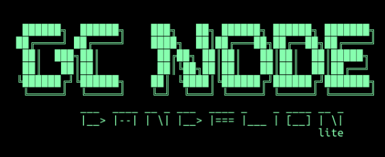

# GC Node

GC Node is based on Koios Lite.

Koios Lite is a streamlined version of the Koios ecosystem, designed for efficient data synchronization and querying on the Cardano blockchain. This setup uses Docker to create a local environment that mirrors the production setup, making it ideal for development and testing.

## Components

This setup includes several key components:

- `cardano-node`: Runs the Cardano node, connecting to either the mainnet or a testnet.
- `cardano-db-sync`: Synchronizes the blockchain data to a PostgreSQL database.
- `postgres`: The PostgreSQL database, storing the synchronized blockchain data.
- `postgrest`: Serves a RESTful API for querying the blockchain data stored in PostgreSQL.
- `haproxy`: A high-performance proxy to distribute network traffic among various components.

Each service is containerized and managed via Docker, ensuring easy deployment and scalability.

## Local Testing

For local testing:

1. Clone the repository to your local machine.
2. Make sure Docker and Docker Compose are installed.
3. Configure the environment variables in a `.env` file based on the provided `env.example`.
4. Run `docker compose up -d` to start the services.
5. Access the local endpoints as needed for testing.

## Deployment

To deploy Koios Lite:

1. Ensure all environment variables are correctly set for the production environment.
2. Use the command `docker compose up -d` to start all the services in detached mode.
3. Use Admin tool to browse to `Tools` > `gLiveView` to monitor that node has reached tip and `Docker` > `Docker Status` to ensure none of the containers are `DOWN` or `UP (unhealthy)` state.
4. Execute `Setup` > `Initialise Postgres` to deploy custom RPCs and test via PostgREST/HAProxy endpoints using curl:
```bash
# PostgREST tip check
curl http://127.0.0.1:8050/rpc/tip

# HAProxy tip check
curl http://127.0.0.1:8053/api/v1/tip
```

Remember to secure your deployment according to best practices, including securing your database and API endpoints.


## Admin tool
A simple script to interact with the all the components of a Koios Lite Node:
[Admin Tool Documentation](AdminTool.md)

```bash
>scripts/koios-lite.sh --help

Koios Administration Tool Help Menu:
------------------------------------

Welcome to the Koios Administration Tool Help Menu.

Below are the available commands and their descriptions:

--about: 			     Displays information about the Koios administration tool.
--install-dependencies:  Installs necessary dependencies.
--check-docker: 		 Checks if Docker is running.
--handle-env-file: 		 Manage .env file.
--reset-env: 			 Resets the .env file to defaults.
--docker-status: 		 Shows the status of Docker containers.
--docker-up: 			 Starts Docker containers defined in docker compose.yml.
--docker-down: 			 Stops Docker containers defined in docker compose.yml.
--enter-node: 			 Accesses the Cardano Node container.
--logs-node: 			 Displays logs for the Cardano Node container.
--gliveview: 			 Executes gLiveView in the Cardano Node container.
--cntools: 			     Runs CNTools in the Cardano Node container.
--enter-postgres: 		 Accesses the Postgres container.
--logs-postgres: 		 Displays logs for the Postgres container.
--enter-dbsync: 		 Accesses the DBSync container.
--logs-dbsync: 			 Displays logs for the DBSync container.
--enter-haproxy: 		 Accesses the HAProxy container.
--logs-haproxy: 		 Displays logs for the HAProxy container.
```
